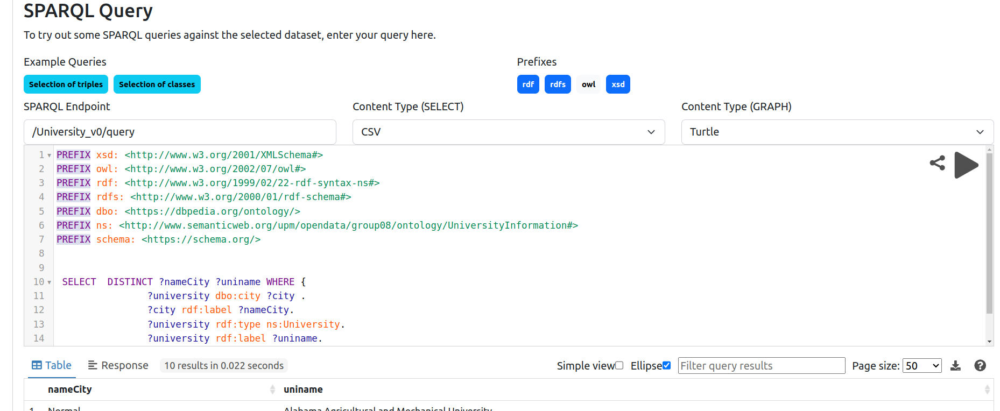
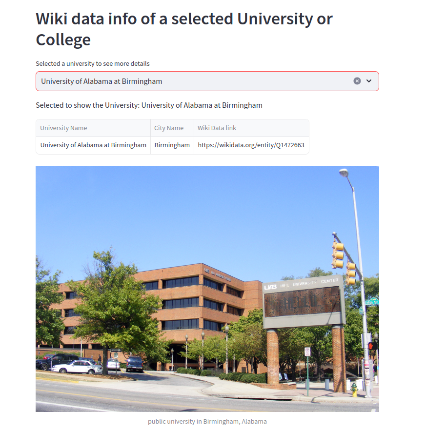

# Members

- [alvaro8gb](https://github.com/Alvaro8gb)
- [Serms1999](https://github.com/Serms1999)
- [RaulMoldes](https://github.com/RaulMoldes)
- [b190042](https://github.com/b190042)

# Shared drive
[link](https://drive.google.com/drive/folders/1lFddzjvD2KSj-DS2Vo8CAs1MFSNIsWGX?usp=sharing)

# Prototypes in Figma
[link](https://www.figma.com/file/h8dZf6KG43KpTJh30N4D1Q/Untitled?type=design&node-id=0%3A1&mode=design&t=clghSJRzTqhfXmNf-1)


# Ontology Diagram


## Extensiones VS-CODE

- SPARQL: ext install Zazuko.sparql-notebook

## Endpoint

Our ontology can be accessed via API using [stain/jena-fuseki](https://hub.docker.com/r/stain/jena-fuseki) 
on Docker Hub.

1. Run fisrt time:
```bash
docker run --name fuseki -p 3030:3030 -e  ADMIN_PASSWORD=pw12,TDB=2 stain/jena-fuseki 
```
2. Create database

3. Insert Data 


4. Make a query



Other commands: 

- Stop:
```bash
docker stop fuseki
```

- Start:
```bash
docker start fuseki
```

## App


